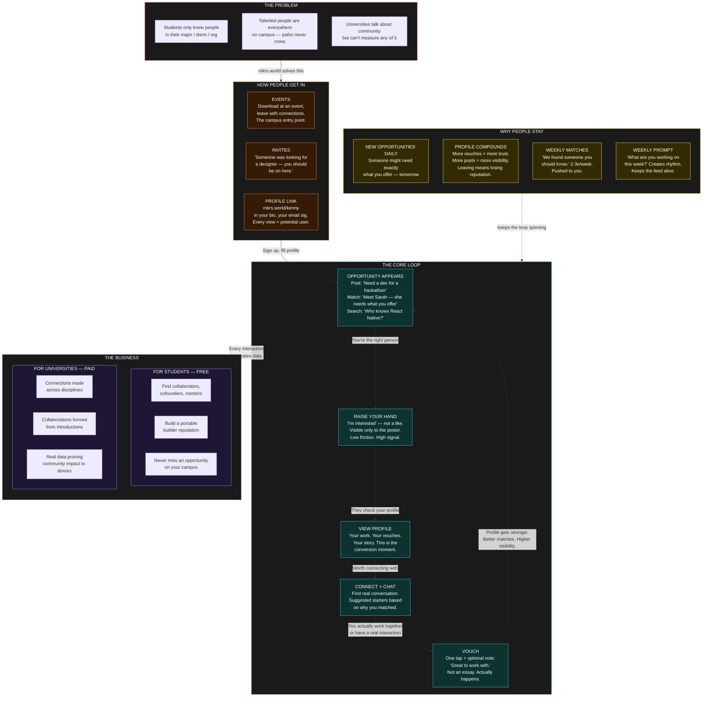

# mkrs.world — Core Loop & Value

```mermaid
flowchart TB
    subgraph Problem["THE PROBLEM"]
        direction TB
        P1["Students only know people<br/>in their major / dorm / org"]
        P2["Talented people are everywhere<br/>on campus — paths never cross"]
        P3["Universities talk about community<br/>but can't measure any of it"]
    end

    subgraph Entry["HOW PEOPLE GET IN"]
        direction LR
        Events["EVENTS<br/>Download at an event,<br/>leave with connections.<br/>The campus entry point."]
        Invite["INVITES<br/>'Someone was looking for<br/>a designer — you should<br/>be on here.'"]
        Profile["PROFILE LINK<br/>mkrs.world/kenny<br/>in your bio, your email sig.<br/>Every view = potential user."]
    end

    subgraph Loop["THE CORE LOOP"]
        direction TB

        Opportunity["OPPORTUNITY APPEARS<br/>Post: 'Need a dev for a hackathon'<br/>Match: 'Meet Sarah — she needs what you offer'<br/>Search: 'Who knows React Native?'"]

        Opportunity -->|"You're the right person"| Hand

        Hand["RAISE YOUR HAND<br/>'I'm interested' — not a like.<br/>Visible only to the poster.<br/>Low friction. High signal."]

        Hand -->|"They check your profile"| ProfileView

        ProfileView["VIEW PROFILE<br/>Your work. Your vouches.<br/>Your story. This is the<br/>conversion moment."]

        ProfileView -->|"Worth connecting with"| Connect

        Connect["CONNECT + CHAT<br/>First real conversation.<br/>Suggested starters based<br/>on why you matched."]

        Connect -->|"You actually work together<br/>or have a real interaction"| Vouch

        Vouch["VOUCH<br/>One tap + optional note.<br/>'Great to work with.'<br/>Not an essay. Actually happens."]

        Vouch -->|"Profile gets stronger.<br/>Better matches. Higher visibility."| Opportunity
    end

    subgraph Sticky["WHY PEOPLE STAY"]
        direction TB
        S1["NEW OPPORTUNITIES DAILY<br/>Someone might need exactly<br/>what you offer — tomorrow"]
        S2["PROFILE COMPOUNDS<br/>More vouches = more trust.<br/>More posts = more visibility.<br/>Leaving means losing reputation."]
        S3["WEEKLY MATCHES<br/>'We found someone you<br/>should know.' 2-3x/week.<br/>Pushed to you."]
        S4["WEEKLY PROMPT<br/>'What are you working on<br/>this week?' Creates rhythm.<br/>Keeps the feed alive."]
    end

    subgraph Value["THE BUSINESS"]
        direction TB

        subgraph Students["FOR STUDENTS — FREE"]
            V1["Find collaborators,<br/>cofounders, mentors"]
            V2["Build a portable<br/>builder reputation"]
            V3["Never miss an opportunity<br/>on your campus"]
        end

        subgraph University["FOR UNIVERSITIES — PAID"]
            V4["Connections made<br/>across disciplines"]
            V5["Collaborations formed<br/>from introductions"]
            V6["Real data proving<br/>community impact to donors"]
        end
    end

    Problem -->|"mkrs.world solves this"| Entry
    Entry -->|"Sign up, fill profile"| Opportunity
    Loop -->|"Every interaction<br/>generates data"| Value
    Sticky -.->|"keeps the loop spinning"| Loop

    style Problem fill:#1a1a1a,stroke:#ff4444,color:#fff
    style Entry fill:#1a1a1a,stroke:#ff8c42,color:#fff
    style Loop fill:#1a1a1a,stroke:#4ecdc4,color:#fff
    style Sticky fill:#1a1a1a,stroke:#ffe66d,color:#fff
    style Value fill:#1a1a1a,stroke:#a78bfa,color:#fff
    style Opportunity fill:#0d3331,stroke:#4ecdc4,color:#fff
    style Hand fill:#0d3331,stroke:#4ecdc4,color:#fff
    style ProfileView fill:#0d3331,stroke:#4ecdc4,color:#fff
    style Connect fill:#0d3331,stroke:#4ecdc4,color:#fff
    style Vouch fill:#0d3331,stroke:#4ecdc4,color:#fff
    style Events fill:#331a00,stroke:#ff8c42,color:#fff
    style Invite fill:#331a00,stroke:#ff8c42,color:#fff
    style Profile fill:#331a00,stroke:#ff8c42,color:#fff
    style S1 fill:#332b00,stroke:#ffe66d,color:#fff
    style S2 fill:#332b00,stroke:#ffe66d,color:#fff
    style S3 fill:#332b00,stroke:#ffe66d,color:#fff
    style S4 fill:#332b00,stroke:#ffe66d,color:#fff
    style Students fill:#1e1533,stroke:#a78bfa,color:#fff
    style University fill:#1e1533,stroke:#a78bfa,color:#fff
```
